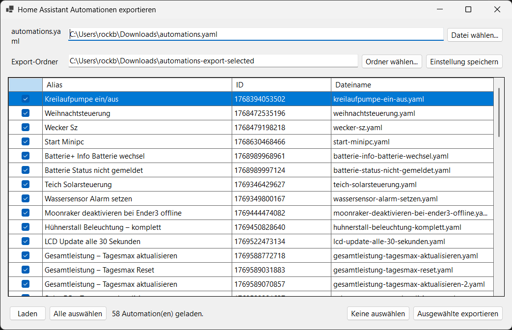
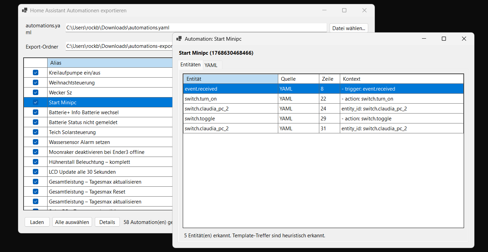
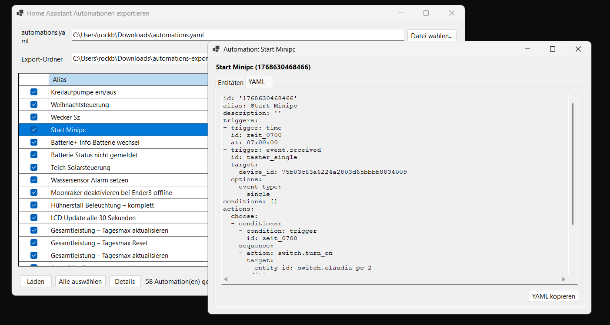

# Home Assistant Automation Exporter

Windows tool to export Home Assistant `automations.yaml` entries into separate YAML files.



## Features

- Open a Windows selection window without command-line arguments.
- Select a Home Assistant `automations.yaml` file.
- Review all automations in a table with checkboxes.
- Open a detail dialog per automation with detected entities and the full YAML code.
- Keep the main window focused on loading and exporting automations.
- Configure the export folder and UI language in the settings dialog.
- Export selected automations as individual `.yaml` files.
- Persist the export folder in `HaAutomationExporter.settings.json` next to the EXE for portable use.

## Languages

The exporter supports:

- System
- German
- English
- French
- Spanish
- Polish
- Russian

`System` detects the Windows UI language for `de`, `en`, `fr`, `es`, `pl` and `ru`. Any unsupported system language falls back to English.

The selected language is stored in `HaAutomationExporter.settings.json` next to the EXE.

## Automation Details

Select an automation and click **Details**, or double-click the row, to inspect it before exporting.



The **Entities** tab lists detected Home Assistant entities with source, line number and context. Template matches are detected heuristically.



The **YAML** tab shows the full automation code and includes a copy button.

## Run

```powershell
dotnet run --project .\HaAutomationExporter.csproj
```

## Command-Line Notes

The project is built as `WinExe` so the app starts without a console window. The exporter logic still accepts
command-line arguments internally, but normal use is the Windows selection window.

## Requirements

- Windows
- .NET 9 SDK
